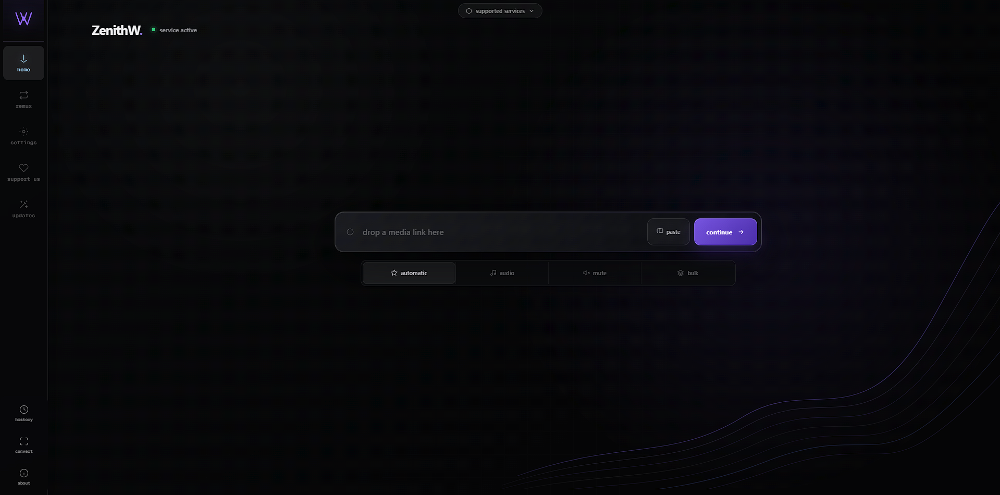

# ZenithW

> Ein fokussierter, werbefreier Medien-Arbeitsbereich zum Herunterladen, Konvertieren und Remuxen von Inhalten, die du verwenden darfst. ✨

[Live-App](https://zenithw.space) · [Status](https://zenithw.space/status) · [Updates](https://zenithw.space/updates) · [English](README.md) · [Türkçe](README.tr.md) · [Français](README.fr.md) · [日本語](README.ja.md)

Aktuelle Version: **v14.4**



## ✨ Warum ZenithW?

ZenithW hält Medienaufgaben bewusst einfach: Füge einen unterstützten Link ein, prüfe, was die Quelle tatsächlich anbietet, wähle die gewünschte Ausgabe und lade die vorbereitete Datei herunter.

Es gibt kein Kontosystem, keine Browser-Erweiterung, keine Paywall, kein Abo und keine Werbeschicht im Ablauf.

Nur praktische Medienwerkzeuge, klare Einstellungen und ehrlich kommunizierte Grenzen.

- **Ein fokussierter Arbeitsbereich** für Downloads, Audio-Extraktion, Konvertierung und Remuxing.
- **Datenschutzorientiert:** Der Verlauf bleibt im Browser und vorbereitete Dateien laufen automatisch ab.
- **Ehrliche Einstellungen:** Ein Profil ist eine Präferenz und keine Garantie dafür, dass jede Quelle jedes Format anbietet.
- **Keine Werbung:** ZenithW fügt dem Download-Ablauf keine Werbung hinzu.
- **Self-Hosting-fähig:** Mit Docker Compose können Oberfläche und API auf dem eigenen Rechner oder Server betrieben werden. 🐳

## Was kann ZenithW?

ZenithW arbeitet mit unterstützten, yt-dlp-kompatiblen Medienquellen.

Der öffentliche Dienst unterstützt derzeit unter anderem:

- TikTok
- Instagram
- X
- Reddit
- weitere kompatible Quellen, die von der aktiven yt-dlp-Integration unterstützt werden

ZenithW kann:

- Video und Audio herunterladen.
- Audio aus Medien extrahieren.
- Stummes Video herunterladen, sofern unterstützt.
- Playlists und kleine Link-Sammlungen verarbeiten.
- Dateien mit FFmpeg konvertieren.
- Kompatible Audio- und Videostreams ohne unnötiges Re-Encoding remuxen.
- Untertitel herunterladen.
- Unterstützte Metadaten beibehalten.
- Thumbnails herunterladen und einbetten.
- SponsorBlock verwenden, sofern verfügbar.
- Aktive Jobs abbrechen.
- Live-Fortschritt anzeigen.
- Den Download-Verlauf lokal im Browser statt in einem Serverkonto speichern.

> **YouTube-Hinweis:** YouTube-Downloads sind im öffentlichen ZenithW-Dienst derzeit deaktiviert, weil vorgelagerte Zugriffsbeschränkungen Anfragen aus gehosteten Web- und Rechenzentrums-Infrastrukturen betreffen. Weitere Informationen findest du unter **YouTube-Verfügbarkeit**.

Der Ablauf ist kurz und nachvollziehbar:

1. Unterstützten Link einfügen.
2. Mediendetails und verfügbare Formate prüfen.
3. Ausgabe konfigurieren.
4. Job starten.
5. Vorbereitete Datei direkt im Browser herunterladen.

Für die Webversion sind weder Konto noch Browser-Erweiterung oder Desktop-Client erforderlich.

## Download-Einstellungen

Die Hauptoberfläche unterstützt:

- automatische Formatauswahl
- Video-Downloads
- Audio-Extraktion
- stummes Video
- Playlist-Verarbeitung
- kleine Link-Sammlungen
- Auflösungsauswahl
- Container-Auswahl
- Codec-Präferenzen
- Audio-Bitrate
- Untertiteloptionen
- Metadaten-Einbettung
- Thumbnail-Verarbeitung
- Dateinamensvorlagen
- SponsorBlock-Einstellungen

Die verfügbaren Optionen hängen davon ab, was die Quellplattform tatsächlich bereitstellt.

ZenithW erfindet keine Formate, die die Quelle nicht anbietet.

### Download-Profile

ZenithW bietet drei praktische Profile.

#### Minimal

Bevorzugt kleinere Dateien, schnellere Übertragungen, breite Kompatibilität und geringen Speicherbedarf.

#### Standard

Zielt auf ein ausgewogenes Verhältnis aus Qualität und Kompatibilität.

Typisches Ziel:

- 1080p
- H.264
- MP4
- 192 kbps Audio

Die tatsächliche Ausgabe hängt von den verfügbaren Streams ab.

#### Quality

Bevorzugt höherwertige Streams, wenn verfügbar.

Mögliche Präferenzen:

- hohe Auflösung
- AV1
- WebM
- Opus-Audio

Auch hier ist das Profil eine Präferenz und keine Garantie.

Drittanbieter-Plattformen bestimmen, welche Streams tatsächlich verfügbar sind.

## Medienwerkzeuge

ZenithW enthält neben Link-Downloads auch Werkzeuge für lokale Dateien.

### Convert

Convert lädt eine lokale Datei hoch und verarbeitet sie mit FFmpeg in das gewählte Zielformat.

Nützlich, wenn eine Datei benötigt:

- einen anderen Container
- ein anderes Audioformat
- bessere Gerätekompatibilität
- ein einfacheres Ausgabeformat

### Remux

Remux kopiert kompatible Audio- und Videostreams in einen anderen Container, ohne sie neu zu codieren.

Das kann deutlich schneller sein als eine vollständige Konvertierung und vermeidet unnötigen Qualitätsverlust.

Remuxing funktioniert nur, wenn die Quellstreams mit dem Zielcontainer kompatibel sind.

Convert und Remux:

- zeigen den Verarbeitungsfortschritt
- liefern temporär vorbereitete Dateien
- dienen nicht als permanenter Cloud-Speicher
- unterliegen serverseitigen Größen- und Verarbeitungslimits

## Verarbeitung auf dem Gerät · Beta

Convert und Remux enthalten experimentelle Modi für lokale Verarbeitung:

- **Server**
- **Prefer this device**
- **Only this device**

Die lokale Beta kann kompatible Medienstreams ohne Re-Encoding kopieren und kompatibles Audio direkt auf dem Gerät extrahieren.

### Server

Die Verarbeitung erfolgt auf dem ZenithW-Backend.

Dies ist die Standardeinstellung.

### Prefer this device

ZenithW versucht die Verarbeitung zuerst auf dem aktuellen Gerät.

Falls dies fehlschlägt, muss der Nutzer dem Upload zum Server ausdrücklich zustimmen.

### Only this device

Die Datei wird niemals auf den ZenithW-Server hochgeladen.

Wenn das Gerät den Job nicht ausführen kann, schlägt er lokal fehl.

### Aktuelle Grenzen

- Desktop: bis zu **64 MiB**
- Mobil / Geräte mit wenig Speicher: bis zu **24 MiB**
- Maximale Mediendauer: **30 Minuten**

Die aktuelle Beta erhält nicht:

- Untertitel
- Kapitel
- Anhänge

Link-basierte Downloads nutzen weiterhin das Backend.

Siehe:

[Dokumentation zur lokalen Medienverarbeitung](docs/LOCAL_MEDIA.md)

## YouTube-Verfügbarkeit

YouTube-Downloads sind im **öffentlichen ZenithW-Dienst derzeit deaktiviert**.

Dabei handelt es sich nicht um einen normalen ZenithW-Anwendungsfehler.

YouTube kann Zugriffsbeschränkungen für Anfragen aus gehosteten Web-Infrastrukturen, Cloud-Servern und Rechenzentrums-IP-Bereichen anwenden.

Da das öffentliche ZenithW-Backend auf solcher Infrastruktur läuft, können seine Anfragen anders behandelt werden als Anfragen aus normalen privaten Netzwerken oder Browsern.

Dadurch kann YouTube Anfragen ablehnen oder einschränken, obwohl:

- ZenithW selbst korrekt funktioniert
- yt-dlp betriebsbereit ist
- FFmpeg verfügbar ist
- das Backend gesund ist
- die Medienpipeline normal funktioniert

### Getestete Ansätze

Mehrere anwendungsseitige Maßnahmen wurden getestet:

- aktualisierte authentifizierte Cookies
- automatische Cookie-Erneuerung
- Cookie-Refresh-Dienste
- PO-Token-Integration
- PO-Token-Generierungsdienste
- yt-dlp-Updates
- Extractor-Updates
- Session-Anpassungen
- Request-Anpassungen

Einige Methoden konnten einzelne Anfragen vorübergehend verbessern, aber keine davon bot eine ausreichend zuverlässige Grundlage für den öffentlichen Dienst.

### Warum Cookies und PO Tokens nicht ausreichen

Cookies und PO Tokens können bei bestimmten YouTube-Zugriffsbedingungen helfen, kontrollieren aber nicht alle Faktoren, die über die Annahme einer Anfrage entscheiden.

YouTube kann zusätzlich bewerten:

- Reputation von Cloud- oder Rechenzentrums-IPs
- Herkunft der Anfrage
- Kontostatus
- Sitzungsstatus
- Authentifizierungsanforderungen
- plattformseitige Rate-Limits
- Anti-Abuse-Systeme
- regionale Einschränkungen
- sich schnell änderndes Plattformverhalten

Ein gültiges Cookie oder PO Token garantiert daher **keinen** erfolgreichen Zugriff von einem öffentlichen Cloud-Backend.

ZenithW stellt diese Mechanismen nicht als universelle Umgehungsmethode dar.

### Warum YouTube im öffentlichen Dienst deaktiviert wurde

Wiederholte Anfragen über dieselbe gehostete Infrastruktur würden nur unnötige Fehler erzeugen, ohne ein zuverlässiges Nutzererlebnis zu bieten.

Zudem könnte dies die gemeinsame Backend-IP weiter belasten, ohne die eigentliche Plattformbeschränkung zu lösen.

Deshalb wurde YouTube auf der öffentlichen ZenithW-Website bewusst deaktiviert.

### Wurde YouTube dauerhaft entfernt?

Nein.

Die YouTube-Unterstützung wurde **nicht dauerhaft aus dem ZenithW-Projekt entfernt**.

Sie kann zum öffentlichen Dienst zurückkehren, wenn eine zuverlässige und wartbare Lösung verfügbar wird.

Die aktuelle Einschränkung betrifft insbesondere die öffentlich gehostete ZenithW-Instanz.

### Self-Hosted-Installationen

Self-Hosted-Installationen verwenden ihre eigene:

- IP-Adresse
- Netzwerkverbindung
- yt-dlp-Installation
- Authentifizierung
- Cookies
- optionale Token-Konfiguration

Deshalb kann sich das YouTube-Verhalten von dem des öffentlichen Dienstes unterscheiden.

Self-Hosting garantiert den Zugriff auf YouTube ebenfalls nicht.

Die Verfügbarkeit hängt weiterhin von den YouTube-Regeln und der Netzwerkumgebung ab.

## Plattformverfügbarkeit

Die Unterstützung externer Plattformen ist grundsätzlich best-effort.

Ein Job kann aus Gründen außerhalb der Kontrolle von ZenithW scheitern:

- gelöschte Medien
- private Medien
- Altersbeschränkungen
- Login-Anforderungen
- regionale Einschränkungen
- nicht verfügbare Formate
- Rate-Limits
- Änderungen an API oder Website
- Anti-Abuse-Systeme
- Netzwerkbeschränkungen
- entfernte Inhalte

ZenithW versucht diese Grenzen klar zu melden, statt nicht verfügbare Ausgaben als erfolgreich darzustellen.

## Benutzererlebnis und Datenschutz

ZenithW hält die Oberfläche bewusst leichtgewichtig.

Die Anwendung bietet:

- Live-Fortschritt
- Abbrechen
- browserlokalen Verlauf
- responsive Desktop-Navigation
- responsive Mobile-Navigation
- mehrere Sprachen
- kein verpflichtendes Benutzerkonto

Vorbereitete Dateien existieren nur für ein begrenztes Übertragungsfenster.

Download-Links sind:

- temporär
- bei Bedarf an den anfragenden Client gebunden
- nach Nutzung oder Ablauf automatisch entfernt

ZenithW ist nicht als permanenter Online-Medienspeicher gedacht.

### Browserlokaler Verlauf

Der Download-Verlauf wird im Browser statt in einem ZenithW-Konto gespeichert.

Dadurch bleibt grundlegender Komfort ohne Registrierung möglich.

Das Löschen der Browserdaten kann auch diesen Verlauf löschen.

## Architektur

| Ebene | Laufzeit |
|---|---|
| Frontend | Vanilla HTML, CSS und JavaScript auf Cloudflare Pages |
| Edge | Cloudflare DNS, Proxy, TLS und Origin-Verifizierung |
| Backend | Flask, Gunicorn, gevent und Socket.IO auf Amazon EC2 |
| Medien | yt-dlp, FFmpeg, Deno/EJS und optionale Token-Integrationen |
| Service-Verwaltung | Ubuntu, Nginx und systemd |

Das Backend läuft absichtlich mit **einem Worker**.

Job-Status, Socket.IO-Räume und Besitz vorbereiteter Dateien sind prozesslokal.

Mehrere Worker oder Replikas erfordern zuvor gemeinsame Koordination und Speicher.

## 🐳 Self-Hosting mit Docker Compose

Der schnellste Weg zu einer vollständigen ZenithW-Instanz ist Docker Compose.

Es startet:

- Frontend
- Reverse Proxy
- API
- FFmpeg
- Download-Arbeitsbereich
- persistenten temporären Speicher

Die Standardinstallation verwendet bewusst **einen Backend-Worker**.

```bash
git clone https://github.com/boranseasonnew/zenithw.git
cd zenithw
cp .env.example .env
docker compose up -d --build
```

Danach öffnen:

```text
http://localhost:8080
```

Wenn du einen anderen Port oder eine öffentliche Domain nutzt, passe in `.env` gemeinsam an:

- `ZENITHW_PORT`
- `SELF_HOSTED_ORIGIN`

Anschließend neu starten:

```bash
docker compose up -d
```

## Docker-Speicher

Das Docker-Volume `zenithw-downloads` enthält temporäre Verarbeitungsdateien.

Diese werden weiterhin durch ZenithWs normale Ablaufbereinigung entfernt.

Das persistente Volume verhindert vor allem, dass Container-Updates ein aktives Übertragungsfenster sofort unterbrechen.

Es ist nicht als permanenter Medienspeicher gedacht.

## Optionale private Cookies

Einige Quellen können eine angemeldete Browsersitzung verlangen.

Eine private Cookie-Datei kann einer Self-Hosted-Installation optional bereitgestellt werden.

```bash
mkdir -p private
```

Lege deinen Netscape-Export hier ab:

```text
private/cookies.txt
```

Dann:

```bash
cp compose.cookies.example.yml compose.cookies.yml
docker compose -f compose.yml -f compose.cookies.yml up -d
```

Folgende Dateien dürfen niemals in Git committed oder öffentlich geteilt werden:

```text
private/cookies.txt
compose.cookies.yml
```

Cookies sind optional und müssen privat bleiben.

Sie sind **keine universelle Umgehung** von Plattformbeschränkungen.

## Öffentliches Hosting

Für öffentliches Hosting sollte vor dem Docker-Deployment HTTPS sowie eine geeignete Firewall oder ein Reverse Proxy eingesetzt werden.

Cloudflare wird in der offiziellen ZenithW-Infrastruktur verwendet, ist aber für Self-Hosting nicht erforderlich.

## 🛠️ Lokale Entwicklung

### Voraussetzungen

- Python 3.10+
- FFmpeg
- Moderner Browser

Repository klonen:

```bash
git clone https://github.com/boranseasonnew/zenithw.git
cd zenithw/backend
```

Virtuelle Umgebung erstellen:

```bash
python -m venv .venv
```

Aktiviere sie mit dem passenden Befehl für dein Betriebssystem.

Installiere danach die gesperrten Abhängigkeiten:

```bash
pip install --require-hashes -r requirements.lock
```

Backend starten:

```bash
python app.py
```

Die API läuft unter:

```text
http://localhost:5000
```

Serviere `frontend/` mit einem beliebigen statischen Dateiserver.

Development-CORS sollte nur für lokale Cross-Origin-Entwicklung aktiviert werden.

## 🔐 Production-Grundlagen

Production-Deployments benötigen starke private Werte für:

```text
SECRET_KEY
ORIGIN_SECRET
```

Laufzeitlimits, temporäre Dateibudgets, Proxy-Vertrauen, Concurrency-Regeln und Diagnosezugriff werden über die im Backend dokumentierten Umgebungsvariablen konfiguriert.

Wichtige Regeln:

- Secrets nicht in Git speichern.
- Exportierte Cookies nicht in Git speichern.
- Private Browserdaten privat halten.
- EC2-Origin hinter der vorgesehenen Proxy-Kette schützen.
- Gemeinsames Origin-Secret validieren, sofern konfiguriert.
- Besucher-Header nur über vertrauenswürdige Proxy-Infrastruktur akzeptieren.
- Diagnosen privat halten.
- Öffentliche Health-Antworten minimal halten.
- Worker-Zahl nicht erhöhen, bevor gemeinsamer Job-Status und Dateikoordination vorhanden sind.

## Wichtige Endpoints

| Endpoint | Zweck |
|---|---|
| `POST /info` | Metadaten und verfügbare Formate auflösen |
| `POST /download` | Download- oder Extraktionsjob starten |
| `POST /convert` | Hochgeladene Datei konvertieren oder remuxen |
| `POST /cancel` | Aktiven Job abbrechen |
| `GET /files/<token>` | Temporär vorbereitete Datei übertragen |
| `GET /health` | Minimale Liveness-Antwort |
| `GET /ready` | Bereitschaft von Abhängigkeiten und Kapazität |

## Sicherheit

ZenithW begrenzt Remote-Medienverarbeitung, statt beliebige Internet-Eingaben automatisch als vertrauenswürdig zu behandeln.

Zu den Schutzmaßnahmen gehören:

- Validierung entfernter Ziele
- Blockierung privater Ziele
- Blockierung link-lokaler Ziele
- Redirect-Beschränkungen
- Einschränkungen für Medienprotokolle
- Concurrency-Limits
- Verarbeitungslimits
- Speicherplatzlimits
- Ablauf temporärer Dateien
- kurzlebige Datei-Tokens
- eingeschränkte Auslieferung vorbereiteter Dateien

Kein internetbasierter Dienst kann absolute Anonymität, unbegrenzte Verfügbarkeit oder vollständigen Schutz vor Änderungen externer Plattformen garantieren.

ZenithW versucht stattdessen, gespeicherte Daten zu minimieren und Umfang sowie Lebensdauer temporärer Verarbeitung zu begrenzen.

## Verantwortungsvolle Nutzung

Nutze ZenithW nur für Inhalte:

- die dir gehören
- die du herunterladen darfst
- die du rechtmäßig verwenden darfst

Nutzungsbedingungen externer Plattformen und geltendes Urheberrecht bleiben in der Verantwortung des Nutzers.

ZenithW ist nicht mit YouTube, TikTok, Instagram, X, Reddit oder anderen unterstützten Plattformen verbunden.

Plattformunterstützung bedeutet keine Partnerschaft, Empfehlung oder offizielle Integration.

## Fehlerberichte

Reproduzierbare Fehler können über folgende Seite gemeldet werden:

[GitHub Issues](https://github.com/boranseasonnew/zenithw/issues)

Bei einer Meldung:

- Problem klar beschreiben
- reproduzierbare Schritte angeben, wenn möglich
- betroffene ZenithW-Version nennen
- hilfreiche Fehlermeldungen beifügen
- private oder identifizierende Informationen entfernen

Niemals öffentlich teilen:

- Cookies
- Passwörter
- private URLs
- Authentifizierungs-Tokens
- API-Secrets
- personenbezogene Daten

## Lizenz

- **ZenithW:** AGPL-3.0-only
- **Drittanbieter-Abhängigkeiten:** jeweilige Lizenzen
- Details: [THIRD_PARTY_NOTICES.md](THIRD_PARTY_NOTICES.md)
