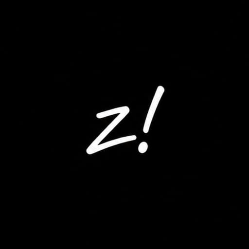

  

<h1 align="center">ZenithW</h1>

  メディアを保存。使い方はシンプル。 
  <a href="https://zenithw.space">Web アプリ</a> · <a href="https://github.com/boranseasonnew/zenithw/releases/latest">Windows</a> · <a href="https://github.com/boranseasonnew/zenithw-android/releases/latest">Android</a>

[English](README.md) · [Türkçe](README.tr.md) · [Français](README.fr.md) · [Deutsch](README.de.md) · [日本語](README.ja.md)

Web v15.2 · ZenithW Desktop v4.1.0

ZenithW は、動画・音声のダウンロード、音声抽出、変換、リマックスができるオープンソースのメディアツールです。広告やサブスクリプションはなく、アカウント登録も不要です。

対応するリンクを貼り付け、形式を選んでダウンロードします。利用できる形式は配信元によって異なります。

## プロジェクト

- [Web インターフェース](frontend/) と [API](backend/)
- [Windows アプリ](desktop/) · [Android ソースコード](https://github.com/boranseasonnew/zenithw-android)

## ドキュメント

- [使い方と制限（英語）](docs/USAGE.md)
- [セルフホストと開発（英語）](docs/SELF_HOSTING.md)
- [端末内でのメディア処理（英語）](docs/LOCAL_MEDIA.md)
- [サービスの状況](https://zenithw.space/status) · [更新情報](https://zenithw.space/updates)

公開 Web サービスでは YouTube のダウンロードを無効にしています。Windows、Android、セルフホスト版はそれぞれのネットワーク接続を使いますが、配信元の制限は引き続き適用されます。

## 責任ある利用

自分が所有するコンテンツ、または利用を許可されたコンテンツだけをダウンロードしてください。配信元の利用規約と著作権を尊重してください。ZenithW は対応プラットフォームと提携していません。

Web 版の履歴はブラウザ内に保存され、サーバー上で準備されたファイルは期限切れになると削除されます。永続的なクラウドストレージではありません。

## 貢献

不具合報告、翻訳、プルリクエストを歓迎します。[貢献ガイド](CONTRIBUTING.md)をご覧いただくか、[Issue](https://github.com/boranseasonnew/zenithw/issues)を作成してください。

## 謝辞

yt-dlp、FFmpeg、Mediabunny などのオープンソースプロジェクトを使用しています。各プロジェクトの開発者と ZenithW の貢献者の皆さんに感謝します。

## ライセンス

[AGPL-3.0-only](LICENSE)。サードパーティの各コンポーネントにはそれぞれのライセンスが適用されます。[ライセンス情報](THIRD_PARTY_NOTICES.md)をご覧ください。
